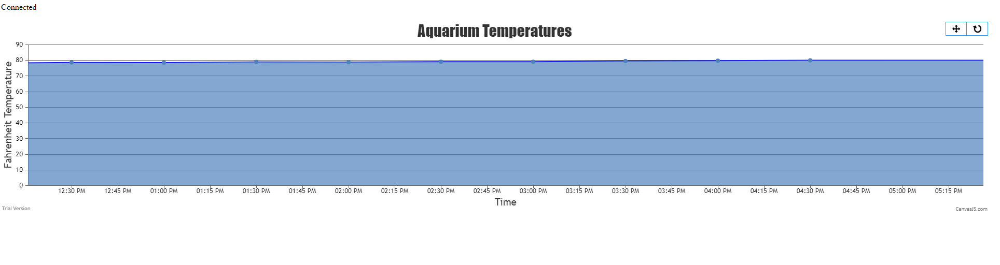

# Projects

## Aquarium Temperature Monitor
This is a personal IOT project I've been working on. The goal of this project is to accurately measure and monitor home aquarium data to make maintenance easier for the aquarium owner. Currently the web application graphs temperature data taken every 30 minutes from the aquarium. Further developments may involve creating a complete management system including an automatic fish feeder, ph level monitoring, and water level monitoring. The hardware used in this project: Arduino, Raspberry Pi, temperature sensor. The software used: C++, Python, PHP, SQLite HTML, CSS.

<a href="{{site.links.github.aquarium}}" target="_blank" rel="noopener noreferrer">Github Repository</a>

## Linear Program Tracker
Personal project to track a linear workout program. Initially started to record my gym sessions.  This is still a work in progress.  Using Django, SQLite3, React.

<a href="{{site.links.github.aquarium}}" target="_blank" rel="noopener noreferrer">Github Repository</a>